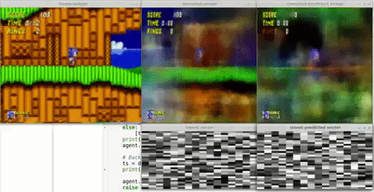

STATUS: This doesn't work well and neither did similar independent attempts. They all got ~2000 performance which is equivalent to learning to press right and occasionally jump. Applying this model to Sonic appears to be quite challenging, but may work on simpler games.

# world-models-sonic-pytorch

https://github.com/wassname/world-models-sonic-pytorch

My attempt to implementing an unsupervised dynamics model with ideas from a few papers
- ["World Models"](https://arxiv.org/abs/1803.10122)
- ["MERLIN "or "Unsupervised Predictive Memory in a Goal-Directed Agent"](https://arxiv.org/abs/1803.10760 )
- ["Decoupling Dynamics and Reward for Transfer Learning"](https://arxiv.org/abs/1804.10689)
- ["Curiosity-driven Exploration by Self-supervised Prediction"](https://arxiv.org/abs/1705.05363)

I use a dynamics model, an inverse model, and a VAE. For the controller I use Proximal Policy Optimization (PPO). I also use a form of Curiosity as an axillary reward.

The end result was a score of 2337/9000 and place ~149 on the leader board to the [OpenAI Retro Content](https://contest.openai.com/). This is the score you can get from constantly running and jumping to the right, sometimes at the right times. So while it shows some interesting behavior it's far from the median score of ~4000 or the top score of 6000.

Independent attempts to apply [world models](https://dylandjian.github.io/world-models/) ([and curiosity](https://flyyufelix.github.io/2018/06/11/sonic-rl.html)) to sonic got similar results [2](https://medium.com/@mrdbourke/the-world-model-of-a-hedgehog-6ff056a6dc7f). I believe this approach may not be well suited to the game.

If you are trying to use and understand my code, I encourage you to check out [dylandjian's write up](ttps://dylandjian.github.io/world-models/) since he tried a world model’s approach, explained it well, and won "Best Write-up"!

If anyone finds the reason why this isn't converging please let me know, I've rewritten it and tried many things but perhaps Sonic is just too complex for world models.

## Curiosity reward

I use a form of Curiosity as an axillary reward. The theory is that we like to see/listen to things that we can learn from, but then we don't want to see them again because we've learnt all we could. There's more about [that theory here](http://people.idsia.ch/~juergen/creativity.html). The goal is that this may teach Sonic to move backward and up and down. Without this he tends to get stuck when it needs to backtrack, because it's only rewarded for going right.

One way to frame this in reinforcement learning is by rewarding a controller for finding novel states and giving them to the world model. Then we measuring how much the loss reduces before and after training. That's out reward (There are probably better ways to frame it).

So I tried that... but the agent liked to stand in place and fill a whole rollout with one frame. Until it had learnt all it could. Then it would casually stroll a little way, and overfit to it's new environment. This can be fixed with tweaking, such as adding a boredom threshold or decreasing the curiosity reward, but I haven't found anything reliable.

## Sources of code

- implementations, which I got code and ideas from
    - https://github.com/AppliedDataSciencePartners/WorldModels
    - https://github.com/JunhongXu/world-models-pytorch
    - https://github.com/goolulusaurs/WorldModels
    - https://github.com/ShangtongZhang/DeepRL
    - https://github.com/hardmaru/pytorch_notebooks/blob/master/mixture_density_networks.ipynb
    - https://github.com/hardmaru/WorldModelsExperiments/blob/master/carracing/rnn/rnn.py

## Setup

- requirements (see `./requirements/requirements.txt`)
    - [openai/retro](https://github.com/openai/retro)
    - [openai/gym_remote (from retro-contest)](https://github.com/openai/retro-contest)
    - [openai/retro-baselines](https://github.com/openai/retro-baselines/blob/master/agents/ppo2.docker)

- roms: you need the ROM files for the Sonic games
    - install from steam
        - [Sonic The Hedgehog](http://store.steampowered.com/app/71113/Sonic_The_Hedgehog/)
        - [Sonic The Hedgehog 2](http://store.steampowered.com/app/71163/Sonic_The_Hedgehog_2/)
        - [Sonic 3 & Knuckles](http://store.steampowered.com/app/71162/Sonic_3__Knuckles/)
        - so download rom files run [this](https://github.com/openai/retro/blob/master/retro/scripts/import_sega_classics.py) then find the rom files in path given by `retro.data_path()`

### Running

I have included the pretrained models in releases

- `04_train_PPO_v4-all-curiosity.ipynb` to train from scratch. Run it with verbose=True to see the performance in a live video.

## Hyperparameters

### Loss weights

The model uses joint training for the VAE, forward, and inverse models (https://arxiv.org/abs/1803.10122). This introduces a few new hyperperameters, but at of 20180520 there is no information on how to set these. The parameters are lambda_vae and lambda_finv.

We want changes to be within an order of magnitude, and we preffer loss VAE to be optimised preferentially, then mdnrnn, then finv. So we want to set it so that loss_vae is large.

For example, if the mdnn is optimised over the VAE, the VAE will learn to output blank images, which the mdnrnn will predict with perfect accuracy. Likewise if the finv is optimised preferentially, the model will only learn to encode the actions in blank images. There are unsatisying local minima.

To set them, you should run for a few epochs with them set to 1, then record the three components of the loss. For example you might get loss_vae=20,000, loss_mdnrnn=3, loss_finv=3. In this case I would set lambda_vae=1/1,00, and the other to one. Keep and eye on the balance between them and make sure they don't get too unbalanced, eventually my unbalanced losses were around loss_vae=2000, loss_mdnrnn=-2, loss_finv=0.1. This means the loss reduction of each was 1800, 5, and 2.5, and the balances loss reductions were 18, 5, and 2.9. All values within an order of mangitude and in an order which follows our preferences.

### Learning rate

Other hyperparamers can sometimes needs to be tweaked. A small learning rate may be needed to initially train the VAE, say 1e-5. Then a higher one may be needed to get the MDRNN to convert, say 3e-4.

Overall it can take quite a small learning rate to train multiple network simultaneously without being to high on any of them.

### Curiosity weights

I haven't found optimal setting for these but you can leave the settings at default values.

## Gradient clipping

Too low and all your updates get normalized to look the same, so even when there is a lot to learn you model learns the same amount from suprising and unsuprising batches. Set it too large and outliers will update your model too far off track. To set this you should look at the variable "grad_norm" which is logged in tensorboard. You can set the value to something between the mean and the maximum values you observe. This depends heavily on reward scaling, model archetecture, and model convergance. Ideally this hyperparamer would be removed and the value would instead be calibrated by a moving average of gradient norms but I haven't seen anyone do this yet.

## Entropy weight

Make sure the PPO entropy_loss doesn't go to ~0. This would mean the entropy loss isn't working, it's mean to punish the agent for being overly certain, and therefore keep it exploring. But a value at near zero (when compared to the policy_loss) means it's stopped exploring and has probobly got stuck in a local mixima such as always pressing right. If so increase your entropy_loss_weight by 10 and keep monitoring it. The potential decrease in the entropy_loss should be comparable to the policy_loss.

For sonic I found this parameter was particularly important since there is a large false minima where it just presses right. So we need entropy weight to be higher than normal but not so high i can't vary it's actions without incurring a penalty. In the end 0.04 worked while 1 was too high and 0.01 was too low.

### Misc

- The controller can't learn much untill you freeze or drastically slow the world-model learning (lr<<1e-5) (TODO confirm this on recent code)
- PPO mini batch size should be higher than normal (20+) or it may not learn (supported by https://arxiv.org/abs/1804.03720)

# Details

- Author: wassname <world-models-sonic-pytorch at wassname dot org>
- Date: 20180606
- Url: https://github.com/wassname/world-models-sonic-pytorch
